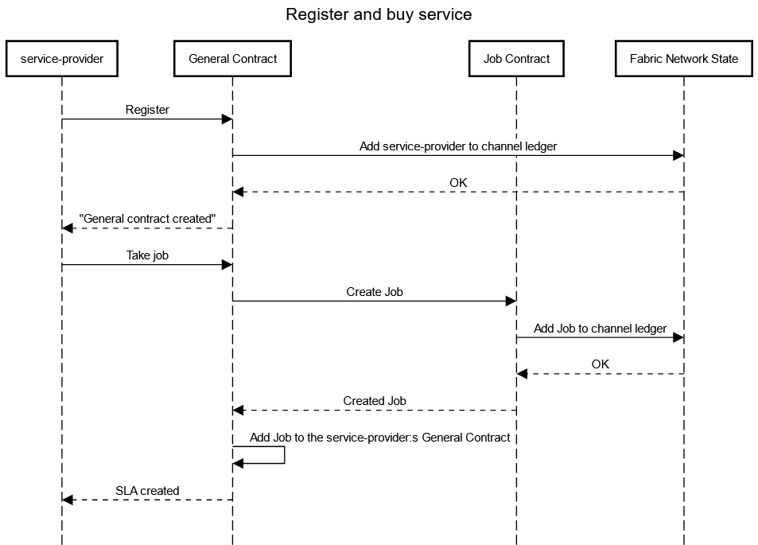
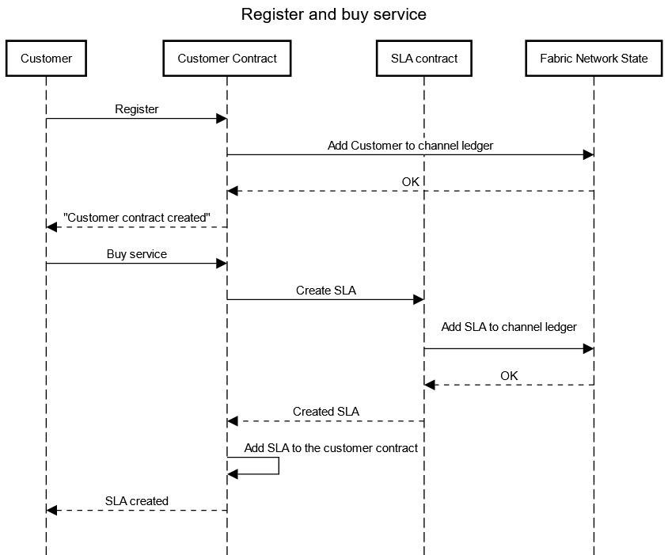
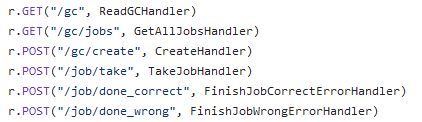
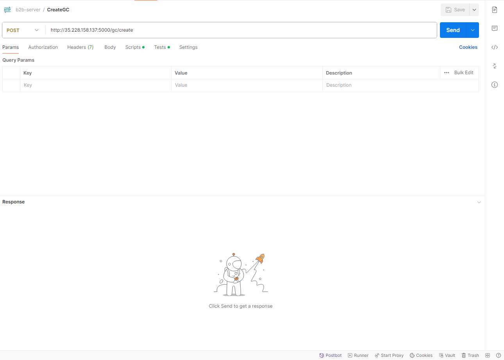
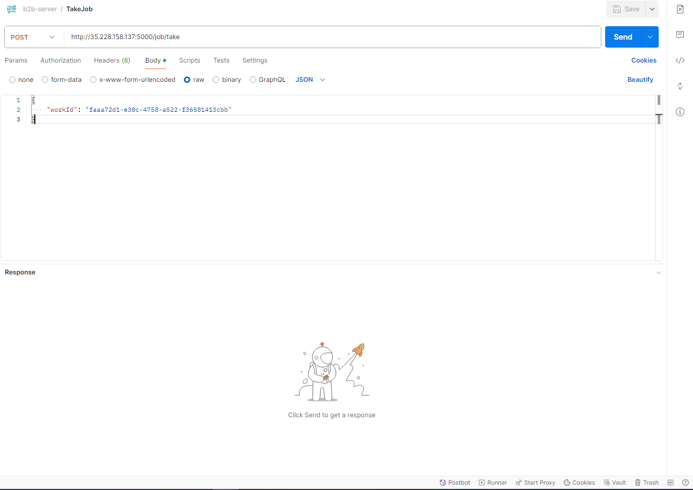
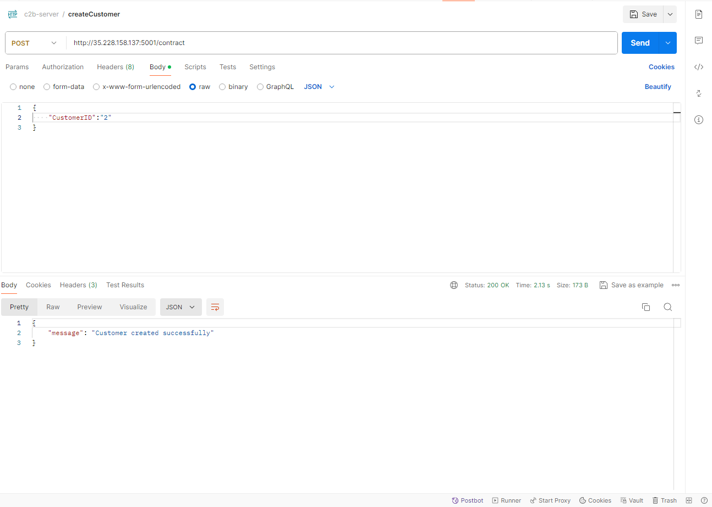
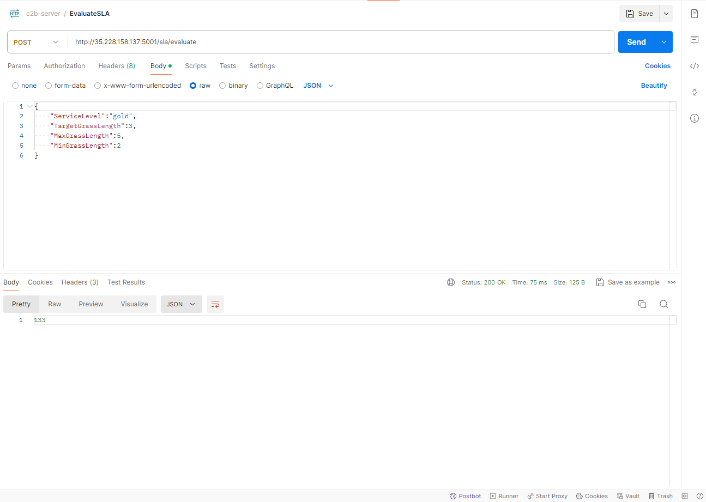
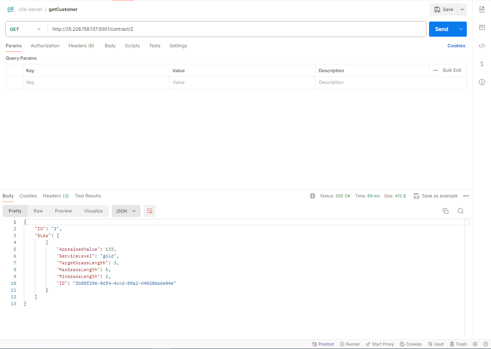
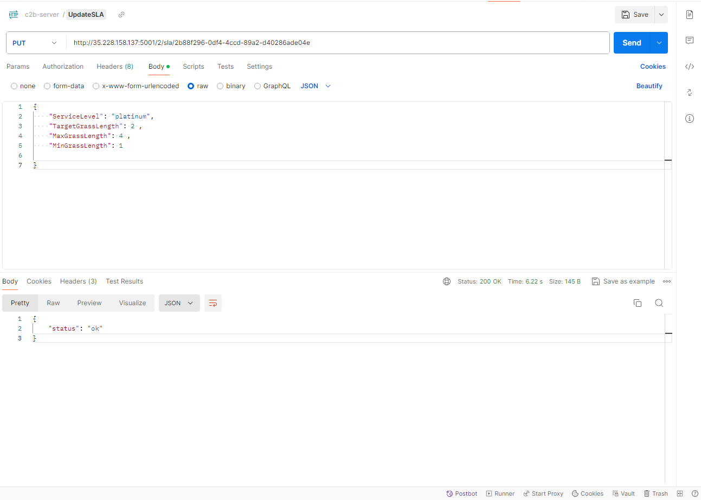
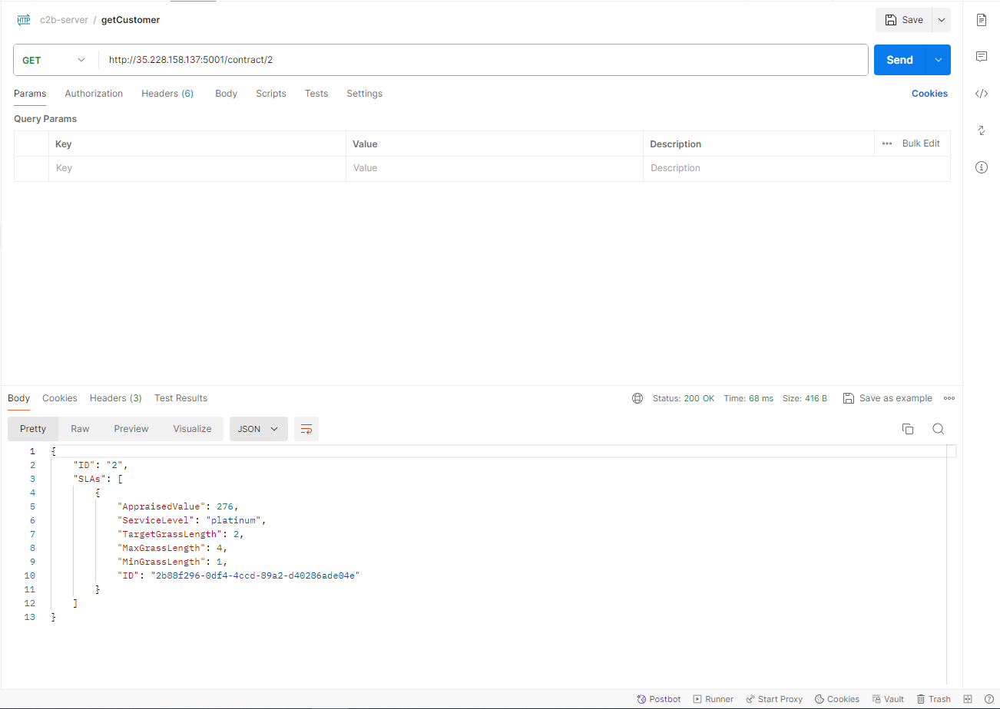

# Code structure
There are three main parts of the implementation. The test-network, the chaincode and the application. Each of these found in their respective folder on github.
## test-network
The test-network part of the implementation is to ease the testing and use of the Hyperledger Fabric Network. This is done by the network.sh script which in turn uses the scripts located in the scripts folder. The network.sh script is used for testing and developing a hyperledger fabric network. It can be used for many purposes however the most important ones for this thesis is:
* Up: Creates a hyperledger fabric network with two organisations and their certificates.
* Down: Brings down the network and all organisations peer, meaning that all channels deployed chaincode is removed.
* createChannel: Creates a channel on the Fabric Network and joins the two organisations created at initialization of the project to the channel.
* DeployCC: Deploys a chaincode to the specified channel

## Chaincode
A chaincode is self executing code that exists on the ledger. Chaincode is Hyperledger Fabrics take on smart contracts (briefly mentioned in 3.2.2) and it is the chaincode that is responsible for the functionality of the contracts. Functionality meaning the modification and calculations of the contracts stored on the Fabric blockchain. For this thesis chaincodes are devided into two categories. Business-to-Business chaincode and Customer-to-Business chaincode.
### Business-to-Business
Business-to-Business chaincode are made for the interaction between service-providers and the service-owner. There are two different levels to them. The first one is the job-contract chaincode which creates a General Contract. The General Contract handles everything related to the service-provider, for example the monthly payout, the services that the service-provider have, how a service-provider takes on a service and how they can confirm that a service is completed. There can only be one General Contract for each service-provider organisation and the id for the contract is automaticly set to the organisations MSP (membership service provider) id. The second level is service chaincode.
A service chaincode represent a service that are available for a service-provider. The service chaincode is responisble for creating and managing a service contract. These are created from within a general contract when a service provider get assigned to a service. If a new type of service is availabe a corresponding chaincode is created for that service, thus new services can be added on demand in the Fabric network. A sequence diagram of how a General Contract is created and how a job is taken can be seen in the image below:

  

### Customer-to-Business
Customer-to-Business chaincode are created for the interaction between service-buyers and the service-owner. Simillar to the Business-to-Business chaincode, there exists two levels of chaincode. The customer chaincode and the SLA chaincode. The customer chaincode are responsible for managing the customer contract. A customer contract contains the customer id and all their active SLA:s. When a customer buys a service the customer contract creates a new SLA for the service and adds it to the contract. The process of registering a customer and buying a service can be seen in the sequence diagram below.

  

More information about the Customer-to-Business chaincodes can be found on the projects github in the chaincode folder. There, all the functionalities of the chaincodes can be studied.

## Application
Applications are used outside of the Fabric network with the main functionality of interacting with the chaincode. Each organization partisipating in the Fabric network are required to implement their own application. This means that each service-provider owns their own application wich uses their own crypographic identification and certificates. In this thesis two applications has been created, one for the customer organisation and one for a service provider organisation. These can be referenced to while creating new applications for new organisations, however they should only be used for testing since they use simple cryptographic identification and certificates.

### B2B-Application
The B2B-app is a REST API that are used by a service-provider to interact with their General Contract. The B2B-app in this thesis is only created for one service-provider meaning that if a service-provider wants to join the Fabric Network, they have to create their own application using the organisations cryptographic credentials and certificates. The endpoints that the service-provider can be seen in the image below.

  

For example if a service-provider wants to take on a job/service they use the /job/take endpoint which will tell the General Contract to create a new service should the service not already be taken by another service-provider. The identification for each service-provider is their MSPID which corresponds to their organisations MSP and is handled within the chaincode.

### C2B-Application
The C2B-App is a REST API that handles the customers interactions with the fabric network. The endpoints that the customers can be used to interact with the Fabric Network can be seen in the image below.

  

For example when a customer wants to buy a service it should send their request to the :customer_id/sla endpoint which in turn will invoke the customer contract chaincode mentioned in the chaincode section. Since there are only one customer organisation there is only one application required for all customers. This means however that the identification of a customer is done with a customers id contrary to the identification of service-providers mentioned above.

# Installation guide
## Prerequesites
The prerequesites mentioned in https://hyperledger-fabric.readthedocs.io/en/latest/prereqs.html, Linux (Ubuntu/Debian based distro)
1. Clone the repository
2. Change directory to the cloned repository
3. Download the hyperledger installation script by using `curl -sSLO https://raw.githubusercontent.com/hyperledger/fabric/main/scripts/install-fabric.sh && chmod +x install-fabric.sh`
4. Specify Docker as the component and run the installation script by running `./install-fabric.sh docker samples binary`
5. Test if everything got installed correctly by going into the test-network directory in the repository and run `./network.sh up`, if installed correctly a fabric network will be created.
6. Add ip-adresses to the chaincode where it is required (the checkOffLedger methods).
### Creating and configuring the technician channel and application:
1. Create the technician channel by running `./network.sh createChannel` inside the test-network directory
2. Install the technicians general contract to the channel by running `./network.sh deployCC -ccn gc -ccp ../chaincode/b2b/job-contract -ccl go`
3. Do the same for all job chaincodes you want to have on the channel. For example `./network.sh deployCC -ccn trapped -ccp ../chaincode/b2b/trapped-contract -ccl go`
4. When all the chaincode has been installed to the technician channel, go back to the root repository directory and change the directory to the application directory
5. Go into the b2b-app start the technician application by running `go run .`, imprtant to note is that a ip-address has to be added to the application and additionally an arrowhead cloud must be able to register the application as a system.
### Creating and configuring the customer channel and application:
1. Create the customer channel by running `./network.sh createChannel -c customer` in the test-network directory
2. Install the customer contract on the customer channel by running `./network.sh deployCC -ccn customer -ccp ../chaincode/c2b/customer -ccl go -c customer`
3. Install the SLA contract on the customer channel by running `./network.sh deployCC -ccn mower -ccp ../chaincode/c2b/mower -ccl go -c customer`
4. Go back to the root directory in the repository and change the directory to the appliaction folder
5. Go to the c2b-app and run the customer application by running `go run .`

# Examples
By following the installation guide, you will not have a working fabric-network to try out and a running application that allows for external systems to communicate with the chaincode and contracts within the network. The examples below will show how the network can be tested. You can use any type of program to send requests to your running applications, however these examples will be using the Postman program.
## Create a technicians general contract, take a job and send confirmation of job done
1. Begin by creating a new technician by sending a POST request to the /gc/create endpoint in the b2b application.
   

    
    

    Which should give a confirmation that a new general contract has been created
2. Take a job by sending a POST request with a valid jobID in the body to the /job/take endpoint in the b2b application.
   

    
    

    If done correct, a confrimation that the work has been taken will be recieved.

3. Check if the job has been added to the general contract by sending a GET request to the /gc endpoint.
   

    
    

4. Confirm that the work has been done and that the error which created the job is correct by sending a POST request to the /job/done_correct with a the jobID used in step 2.
   

    
    

5. Check if the pay of the job has been added to the monthly balance in the general contract by using the same endpoint as in step 3.
   

    
    

We have went through a complete chain of events for a technician from creating one to finishing a job and confirmed that it worked as intended.

## Create a customers customer-contract, evaluate and create a SLA and configure it while it is running

1. Begin by creating a customer contract. Send a POST request to the /contract endpint in the c2b application.
   

    
    

2. Evaluate a SLA by sending a POST request to the /sla/evaluate endpoint which will evaluate the monthly cost of the SLA with the given parameters.
   

    
    

3. Create the SLA with the same parameters which was evaluated in step 2 by sending a POST request to the :customerid/sla endpoint. The UUID that are sent back are the generated UUID for the newly created SLA and should be saved for future steps.
   

    
    

4. We can now check wether the SLA:s montly cost correspondes to the evaluated cost in step 2 by sending a GET request to the /contract/:customerid where :customerid is the id that was submitted in step 1.
   

    
    

5. We will now configure the SLA created in step 3. This is done by sending a PUT request to /:customerid/sla/:slaid where customer id is the id from step 1 and slaid is the id returned from step 3.
   

    
    

6. Lastly, we can now check if the monthly cost of the SLA has changed after we modified it in step 5. We can do this by using the same endpoint as in step 4.
   

    
    

    The SLA should have a new cost compared to when we check in step 4 which completes the example for how we can test the creation of customers, creation of SLA:s and lastly configuration of active SLA:s.
   
   
    

