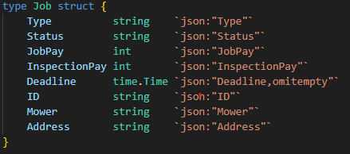

# Code structure
There are three main parts of the implementation. The test-network, the chaincode and the application. Each of these found in their respective folder on github.
## test-network
The test-network part of the implementation is to ease the testing and use of the Hyperledger Fabric Network. This is done by the network.sh script which in turn uses the scripts located in the scripts folder. The network.sh script is used for testing and developing a hyperledger fabric network. It can be used for many purposes however the most important ones for this thesis is:
* Up: Creates a hyperledger fabric network with two organisations and their certificates.
* Down: Brings down the network and all organisations peer, meaning that all channels deployed chaincode is removed.
* createChannel: Creates a channel on the Fabric Network and joins the two organisations created at initialization of the project to the channel.
* DeployCC: Deploys a chaincode to the specified channel

## Chaincode
A chaincode is self executing code that exists on the ledger. Chaincode is Hyperledger Fabrics take on smart contracts (briefly mentioned in 3.2.2) and it is the chaincode that is responsible for the functionality of the contracts. Functionality meaning the modification and calculations of the contracts stored on the Fabric blockchain. For this thesis chaincodes are devided into two categories. Business-to-Business chaincode and Customer-to-Business chaincode.
### Business-to-Business
Business-to-Business chaincode are made for the interaction between service-providers and the service-owner. There are two different levels to them. The first one is the job-contract chaincode which creates a General Contract. The General Contract handles everything related to the service-provider, for example the monthly payout, the services that the service-provider have, how a service-provider takes on a service and how they can confirm that a service is completed. There can only be one General Contract for each service-provider organisation and the id for the contract is automaticly set to the organisations MSP (membership service provider) id. The second level is service chaincode.
A service chaincode represent a service that are available for a service-provider. The service chaincode is responisble for creating and managing a service contract. These are created from within a general contract when a service provider get assigned to a service. The structure of the service contracts can be seen in the figure below.

  

If a new type of service is availabe a corresponding chaincode is created for that service, thus new services can be added on demand in the Fabric network. More information about the Business-to-Business chaincodes can be found on the projects github in the chaincode folder. There all the functionalities of the chaincodes can be studied.

### Customer-to-Business
Customer-to-Business chaincode are created for the interaction between service-buyers and the service-owner. Simillar to the Business-to-Business chaincode, there exists two levels of chaincode. The customer chaincode and the SLA chaincode. The customer chaincode are responsible for managing the customer contract. A customer contract contains the customer id and all their active SLA:s. When a custoemr buys a service the customer contract creates a new SLA for the service and adds it to the contract. The process of creating a new SLA can be seen in the sequence diagram below.

